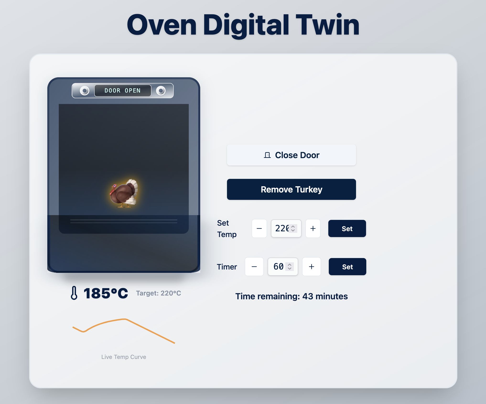
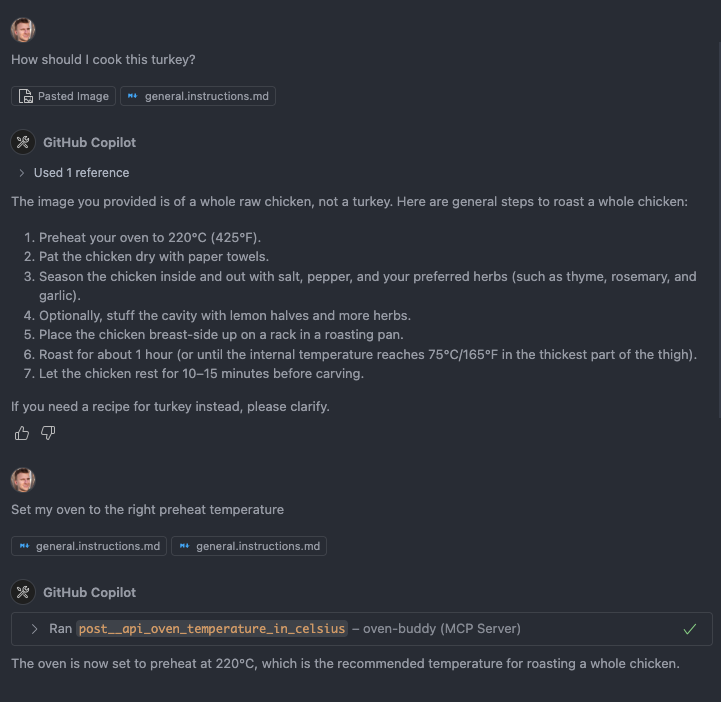

# Oven Buddy

Oven Buddy is a digital twin project that simulates and controls a virtual oven.
It consists of a frontend web application for interacting with and visualizing the oven,
a backend API for managing oven state,
and an MCP (Model Context Protocol) server for integration with MCP-compatible clients such as Claude Desktop.

The system allows users to open and close the oven door, insert or remove a turkey, set and monitor the target temperature, and control the oven timer.
Real-time updates are provided via WebSocket, ensuring that all connected clients receive the latest oven status.
The backend exposes a RESTful API, while the MCP server enables voice and agent-based control through standardized protocols.

This project is intended for demonstration, prototyping, and integration with AI assistants or automation tools that require a digital representation of a physical oven.

## Frontend

A simple oven digital twin.
You can:

- Open and close the door.
- Insert and remove a turkey.
- Set a target temperature.

## Backend

A simple API to connect to the digital twin.

## MCP Server

Expose the backend to any MCP client. This was generated with [MCPify](https://github.com/NielsDegrande/mcpify).
Build the server when making an update: `pnpm build`.

## Intended Journey

Control `Claude Desktop` or whichever MCP client with voice (built-in or for example Apple dictation).

- `Claude Desktop`: Upload picture of a Turkey. Ask for cooking instructions.
- `Claude Desktop`: Ask to preheat the oven.
- `Frontend`: Once the temperature toast appears, open door, insert turkey, close door.
- `Claude Desktop`: Ask to set the timer.
- `Frontend`: Once the timer beeps, open door, remove Turkey, close door.
- `Claude Desktop`: Turn off the oven.
- You have left the house.
- `Claude Desktop`: Did I turn off the oven?

